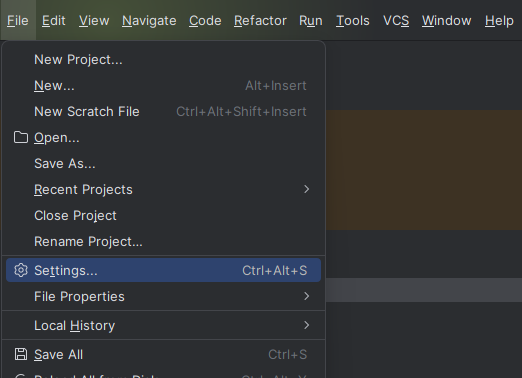
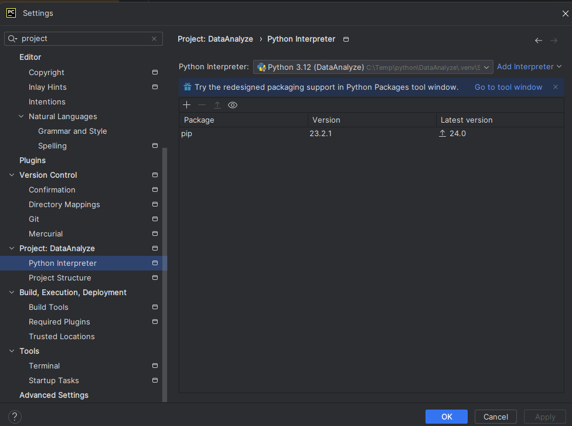
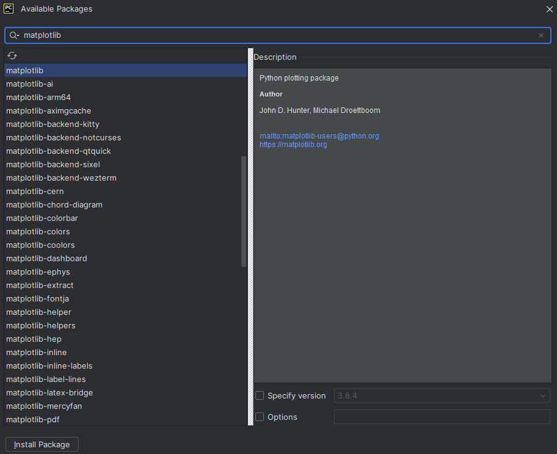

- ##### 1번 : File > setings 클릭

---

- ##### 2번 : Python Interpretor 클릭
- ###### +버튼 클릭

---

- ##### 3번 : matplotlib 다운

---

- ##### 4번 : install Packaage 클릭

- ##### 5번 : 기다리면 적당히 아래에 초록색으로 successfully 뜸
- ###### 어플라이 누르고 적당히 종료
